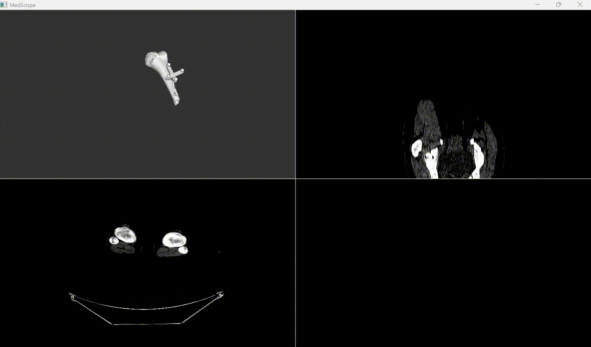

# medscope_demo_project
Demo project for medscope.

## Demo



## Installation

```bash
conda create -n tmp_lab_env python=3.10
conda activate tmp_lab_env

pip install py_ap200_simple_interface
pip install numpy
pip install medscope
pip install read_nii_to_numpy
pip install remote_auto_fetch
```

## Usage

```bash
conda activate tmp_lab_env
python ./medscope_demo_program/main.py
```
